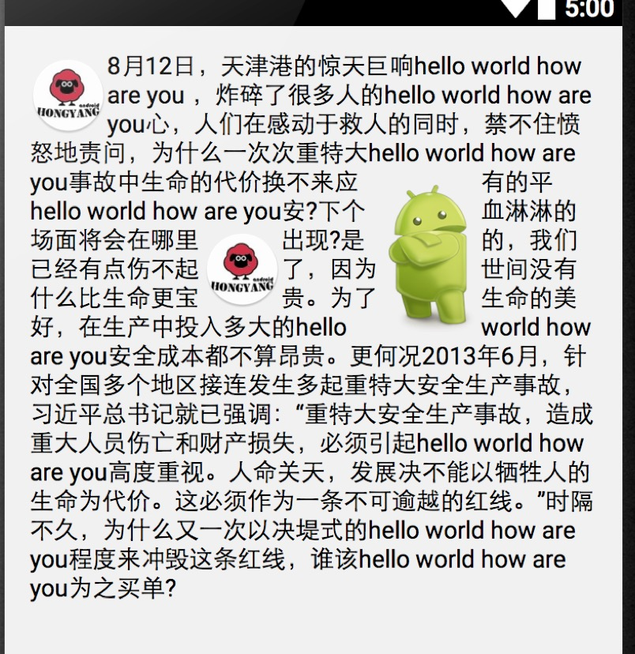
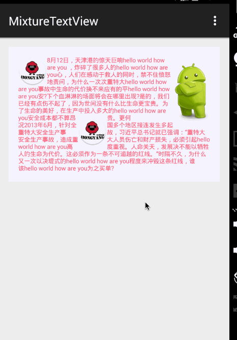

# MixtureTextView
支持Android图文混排、文字环绕图片等效果


## 效果图




---



## 使用

* 代码设置属性

```java

mixtureTextView = 
	(MixtureTextView)findViewById(R.id.id_mixtureTextview);
mixtureTextView.
	setTextColor(0xffff6f2d);//设置字体颜色
mixtureTextView.
	setTextSize(TypedValue.COMPLEX_UNIT_SP, 14);//设置字体大小
mixtureTextView.
	setText(getString(R.string.text1));//设置文本
```

* 布局文件中通过属性设置

```xml
 <com.zhy.view.MixtureTextView
	android:text="@string/text2"
	android:textColor="#ff5d75"
	android:textSize="14sp"
	...其他属性
	>
</com.zhy.view.MixtureTextView>
```

* 上述demo的布局文件

```xml
<com.zhy.view.MixtureTextView
        android:id="@+id/id_mixtureTextview"
        android:layout_width="match_parent"
        android:layout_height="wrap_content"
        android:background="#f4f3ff"
        android:text="@string/text2"
        android:textColor="#ff5d75"
        android:textSize="14sp">

        <ImageView
            android:layout_width="wrap_content"
            android:layout_height="wrap_content"
            android:layout_marginLeft="100dp"
            android:layout_marginTop="100dp"
            android:src="@drawable/icon"/>

        <ImageView
            android:layout_width="wrap_content"
            android:layout_height="wrap_content"
            android:src="@drawable/icon"/>


        <ImageView
            android:layout_width="wrap_content"
            android:layout_height="wrap_content"
            android:layout_alignParentRight="true"
            android:src="@drawable/android2"/>

</com.zhy.view.MixtureTextView>

```
